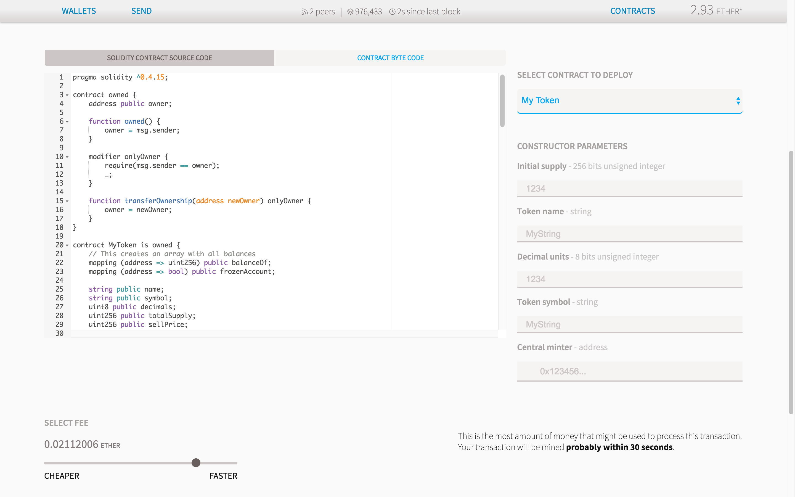
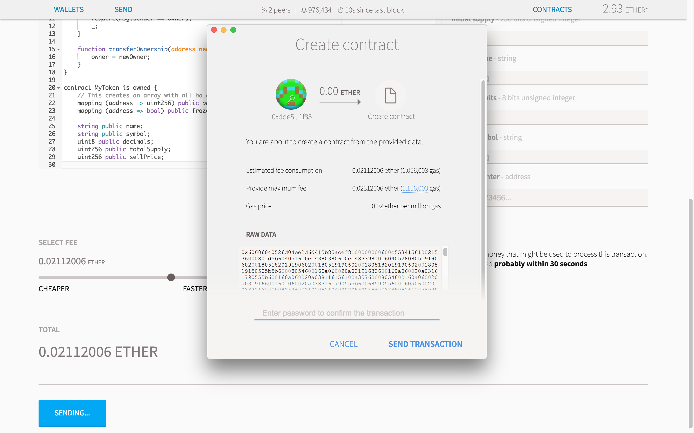
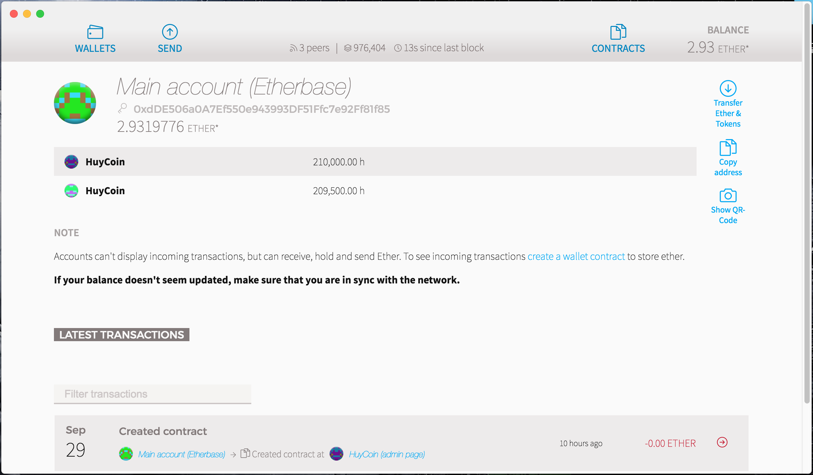
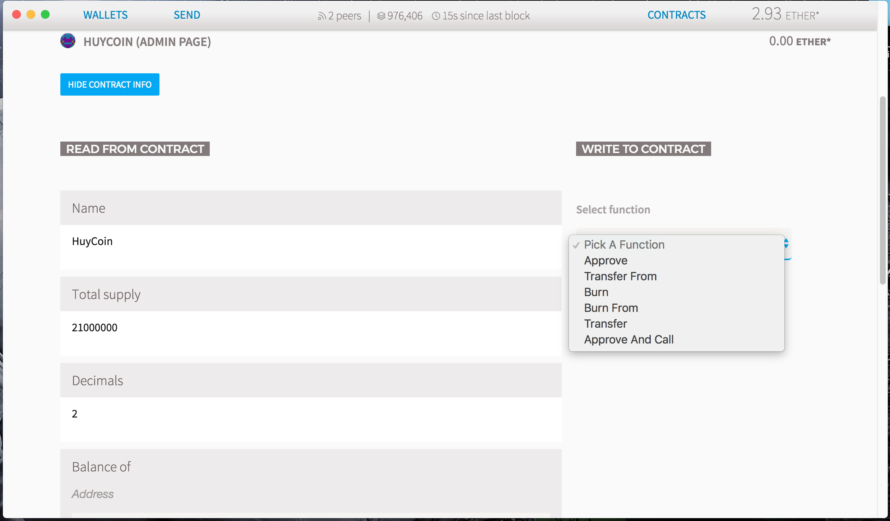
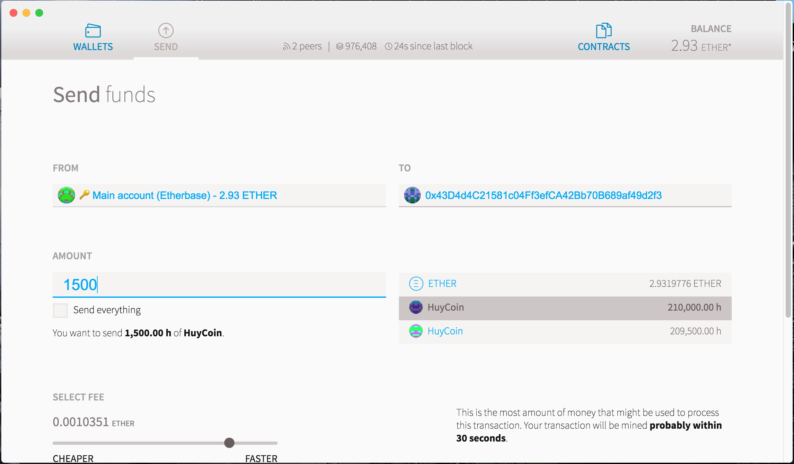
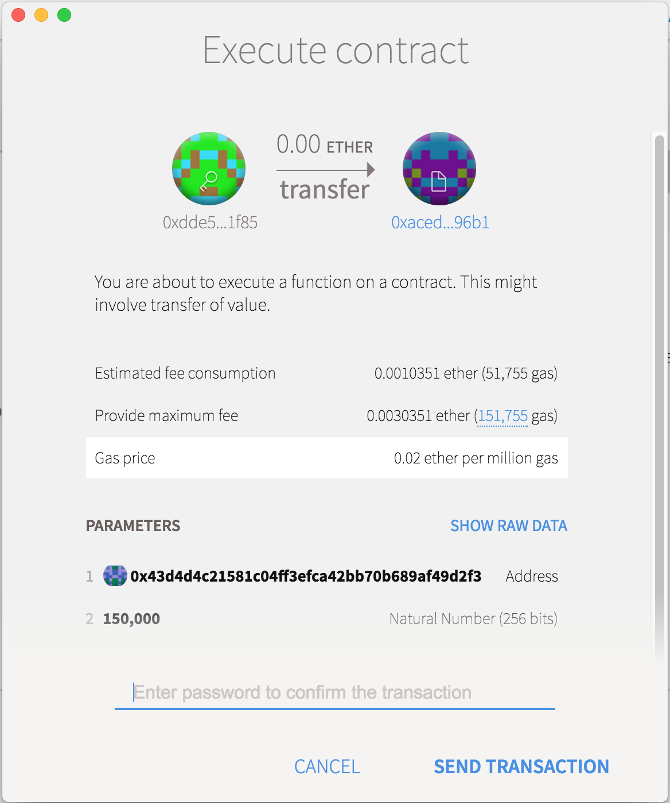
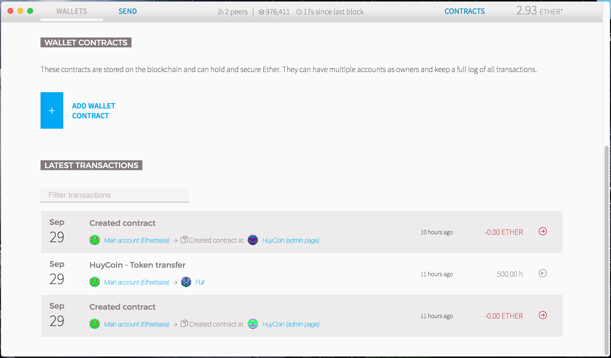

My Token
==========
We are going to create a digital token. Tokens in the ethereum ecosystem can represent any fungible tradable good: coins, loyalty points, gold certificates, IOUs, in game items, etc. Since all tokens implement some basic features in a standard way, this also means that your token will be instantly compatible with the ethereum wallet and any other client or contract that uses the same standards.

## Features
- [x] Init version
- [x] Simple version
- [x] CENTRALIZED ADMINISTRATOR
- [x] CENTRAL MINT
- [x] FREEZING OF ASSETS
- [x] AUTOMATIC SELLING AND BUYING
- [x] AUTOREFILL
- [x] PROOF OF WORK

## Screenshots

##### Code Contract

##### Deploy Contract

##### Main Account Balance

##### My Token Admin Page

##### Send Token to friend

##### Transaction Logs

---

Source: 

- [CREATE YOUR OWN CRYPTO-CURRENCY WITH ETHEREUM](https://ethereum.org/token)
